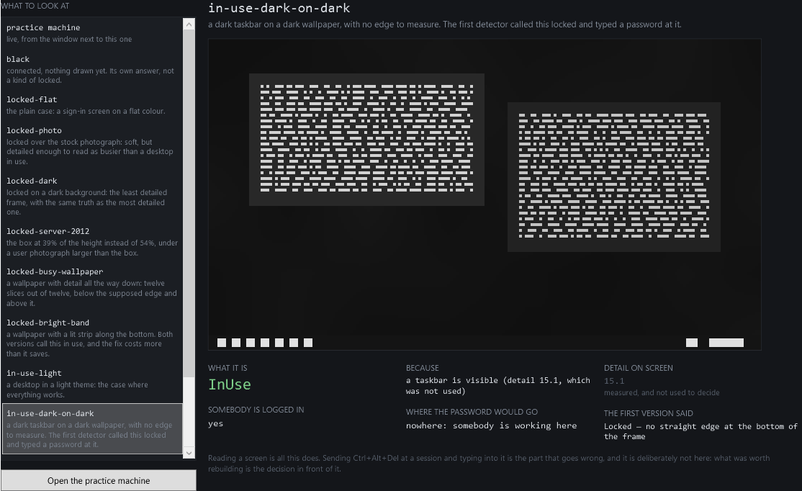
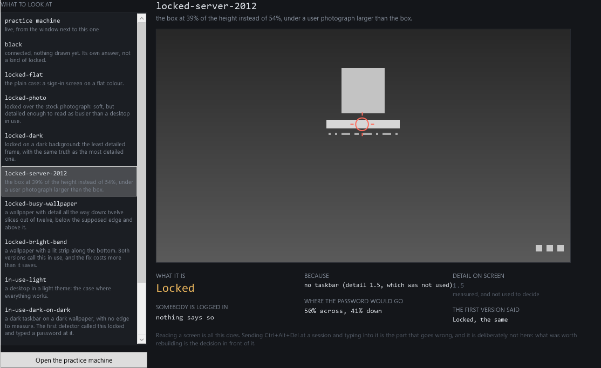
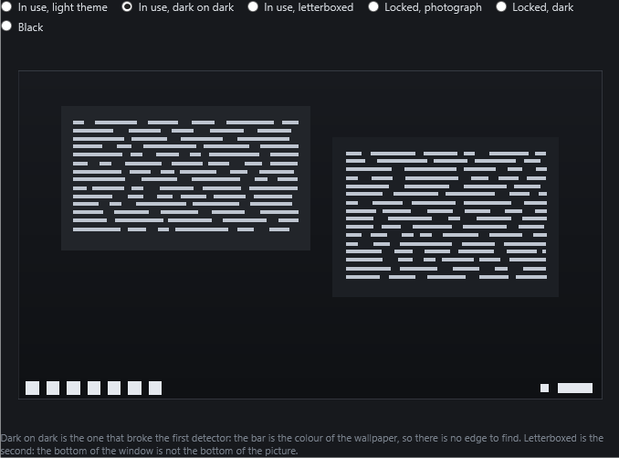

# Remote Support Console

Somebody in support opens a remote session on a machine in another building and
needs to know one thing before doing anything else: **is anybody logged in?**

Inside that session there is nothing to ask. No automation tree, no API, no
window titles — the whole session is one bitmap being repainted a few times a
second. So the question gets answered by looking at it, and the only honest way
to do that is to say out loud what is being looked for, and what it costs to be
wrong.

**The two mistakes do not cost the same.** Deciding a locked machine is in use
means doing nothing; somebody presses the button again. Deciding a machine
somebody is working in is locked means sending Ctrl+Alt+Del at their session and
then typing a password into whatever has focus. One is a wasted click. The other
is a password in a chat window. Everything in this repository is arranged around
that asymmetry.

It comes with three claims, and each of them can fail:

| | |
| --- | --- |
| **The rule that survived reads the corpus, and never the expensive way round.** | **10 of 11** frames, and **0** desktops in use read as locked. The version before it got **8**, and read **2** desktops in use as locked. |
| **No threshold over how detailed the screen is can tell locked from in use.** | Every cut the corpus can distinguish, both directions: the best still reads **3 of 10** wrong. The signal is measured, printed, and never used. |
| **The password box is found by its shape.** | **6 of 6**. A fixed 54% of the height gets **5**; the largest pale rectangle gets **5**, and the one it misses is a face. |

`dotnet run --project src/SupportConsole.Measure` prints those and exits
non-zero if any of them stops being true. So does CI.



---

## What this does not do

It reads screens. It does not send Ctrl+Alt+Del, does not move a mouse, does not
type, and does not connect to anything.

That is not an omission. The input half is a dozen lines and it is the half that
does damage; the decision in front of it is the part that was hard, the part
that was wrong twice on real machines, and the only part worth showing. The
console draws a crosshair where a password *would* go, and stops there.

The screen it reads is a window belonging to the same application — a **practice
machine** you can put into six states, including the two that broke the original.
Nothing here captures a desktop, enumerates windows, or reaches into another
process.

---

## Before you start

**The .NET 9 SDK**, and nothing else. No packages beyond the test runner.

```
dotnet --version        # 9.0.317 here; any 9.0.x will do
```

```
dotnet test src/SupportConsole.Tests            # 58 checks
dotnet run  --project src/SupportConsole.Measure    # the three claims
dotnet run  --project src/SupportConsole.App        # the console (Windows)
```

The last of those is the only line that needs Windows. Everything that decides
anything is in `SupportConsole.Vision`, which targets plain `net9.0`, references
no WPF and no Win32, and is measured and tested on Linux in CI. That is not
tidiness for its own sake: **a decision you cannot run on a build machine is a
decision nobody will ever measure.**

---

## What is in here

| | |
| --- | --- |
| `SupportConsole.Vision` | The deciding. A frame, five signals, two rules, and the version of the rules that was wrong. No Windows anywhere in it. |
| `SupportConsole.Frames` | Eleven drawn screens, and what each one really is. |
| `SupportConsole.Measure` | Runs both rules over all eleven and prints the difference. Exits non-zero when a claim stops holding. |
| `SupportConsole.Tests` | 58 checks, including one that asserts the first version still makes both of its mistakes, and five that hold this page and the comments beside the code to the numbers the program computes. |
| `SupportConsole.App` | The console and the practice machine. WPF, and the only part that needs Windows. |

### Why the corpus is drawn and not photographed

A screenshot of a real machine is somebody's desktop — their files, their mail,
their patients — and no amount of care makes that safe to put in a public
repository. Every frame here is drawn from a seeded generator: the same eleven
frames on every machine and every run, which is what lets this README quote a
number and a test assert it.

It also buys the thing a screenshot cannot. A drawn frame can be varied on one
axis at a time — the same taskbar, with and without an edge under it; the same
wallpaper, with and without detail at the bottom — and that is the difference
between a demonstration and a measurement.

---

## Three things that were believed, and two of them were wrong

**Sharpness.** A working desktop is full of crisp text; a lock screen is a soft
photograph. Detail ought to separate them. It does not. In the corpus, a lock
screen over the stock photograph reads 18.6, one on a dark background reads
2.0, and a desktop in use reads 15.1 to 43.1 — the locked frames sit on **both
sides** of the unlocked ones. The measurement tries every threshold the corpus
can distinguish, in both directions, and the best one still reads three frames
in ten wrong.

The number is still computed, still printed beside every frame, and never used
to decide anything. What it measures is how detailed the wallpaper is.

Those three figures are not typed here from memory: a check recomputes them off
the corpus and fails if this page, or either of the two comments beside the
code, stops agreeing with it. They had drifted apart once already — this page
right, the comments still quoting a corpus that had moved under them.

**A uniform band under a straight edge.** The first taskbar test. On a dark
theme over a dark wallpaper there is no edge to measure: the bar is the colour
of the wallpaper, and at this resolution it is a row of bright dots on black.
The detector said "locked" about a machine somebody was working in.

**The bottom of the frame is the bottom of the picture.** It is not. A remote
desktop whose proportions differ from the window it is shown in gets centred,
with black above and below, so the search was happening inside the black.

What survived is two things a taskbar has and a photograph does not, required
together: a **step in mean brightness** between the bottom strip and the one
above it, and **structure spread horizontally** — icons at one end, a clock at
the other. The step is what carries the dark-on-dark case: the bar has no edge,
but the icons lift the mean of the band by about twenty levels, and a mean does
not need an edge.

---

## The rule that was written, measured, and thrown away

A wallpaper lit along the bottom passes both tests — a step where the light
begins, detail spread the width of it — and reads as a taskbar. The obvious fix
is that above a real taskbar the structure stops, and it works: it turns that
frame from wrong to right.

It also turns a desktop in use over a busy wallpaper from right to wrong,
because there the structure does not stop either.

One frame each way. **Two rules with one error each are not two rules of equal
worth**, and which one ships is decided by the asymmetry at the top of this
page: the rule that ships is wrong about a locked screen, which costs a click.
The other is wrong about somebody's session.

The rejected rule is still in the code, behind a parameter, so the measurement
prints both columns instead of asserting the conclusion.

---

## Finding the password box

The click matters because it is what sends the keystrokes to the remote machine
rather than to the window around it.

The first version clicked at 54% of the height, which is where the box is on the
Windows 10 sign-in screen. On Windows Server 2012 it is at 39%, so the click
landed on the wallpaper and the password went into nothing. **A percentage tuned
on one version of Windows is a fact about that version.**

The second version looked for the largest pale rectangle in the middle of the
screen. It finds the **user photograph**, which is bigger: 20 cells by 21,
against the box's 34 by 4. A text field is much wider than it is tall, and that
one constraint is the whole of the difference.



---

## The practice machine



A window that pretends to be a machine somebody is supporting, in the six states
the corpus covers. The console reads it four times a second, through the same
downsample and the same rules it would use on a remote session.

```
dotnet run --project src/SupportConsole.App -- --check report.txt
```

runs all six without a person, and exits non-zero if any of them reads as
something other than what it was told to be. CI runs that on Windows.

It closes the gap the tests cannot. Drawn frames prove the deciding is right
about drawings; this goes from a real window, rendered by the real graphics
stack at the real size, through the real downsample, to the same answer. It
found a bug the tests could not have: `RenderTargetBitmap` draws a visual
*where it sits* — offset by wherever its parent put it — so capturing an element
forty pixels down a window left forty blank rows at the top and dropped forty
from the bottom, which is where the taskbar is. The same mistake as the
letterbox one, a floor down: something decided the bottom of the picture was
somewhere it was not.

---

## The measurement, in full

Printed by `dotnet run --project src/SupportConsole.Measure`, and checked
against this file by CI, so it cannot quietly stop being what the program says.

```

Eleven frames, drawn. 6 of them are sign-in screens.

  black                    connected, nothing drawn yet. Its own answer, not a kind of locked.
  locked-flat              the plain case: a sign-in screen on a flat colour.
  locked-photo             locked over the stock photograph: soft, but detailed enough to read as busier than a desktop in use.
  locked-dark              locked on a dark background: the least detailed frame, with the same truth as the most detailed one.
  locked-server-2012       the box at 39% of the height instead of 54%, under a user photograph larger than the box.
  locked-busy-wallpaper    a wallpaper with detail all the way down: twelve slices out of twelve, below the supposed edge and above it.
  locked-bright-band       a wallpaper with a lit strip along the bottom. Both versions call this in use, and the fix costs more than it saves.
  in-use-light             a desktop in a light theme: the case where everything works.
  in-use-dark-on-dark      a dark taskbar on a dark wallpaper, with no edge to measure. The first detector called this locked and typed a password at it.
  in-use-letterboxed       the same desktop centred inside black bars. The bottom of the frame is not the bottom of the picture.
  in-use-busy-wallpaper    a taskbar over the wallpaper that has detail everywhere, which is the hardest frame here.

==============================================================================
HOLDS   The rule that survived reads every frame but one, and never the expensive way round
==============================================================================

  frame                   truth   now     first version  rejected rule  
  ----------------------------------------------------------------------
  black                   Black   Black   Locked X       Black          
  locked-flat             Locked  Locked  Locked         Locked         
  locked-photo            Locked  Locked  Locked         Locked         
  locked-dark             Locked  Locked  Locked         Locked         
  locked-server-2012      Locked  Locked  Locked         Locked         
  locked-busy-wallpaper   Locked  Locked  Locked         Locked         
  locked-bright-band      Locked  InUse X Locked         Locked         
  in-use-light            InUse   InUse   InUse          InUse          
  in-use-dark-on-dark     InUse   InUse   Locked X       InUse          
  in-use-letterboxed      InUse   InUse   Locked X       InUse          
  in-use-busy-wallpaper   InUse   InUse   InUse          Locked X       
  ----------------------------------------------------------------------
  right                           10/11   8/11           10/11          
  in use, read as locked          0       2              1              

    The first version misses two desktops somebody was working in: the dark
    taskbar it could find no edge under, and the one inside black bars. It also
    calls a black screen locked, which is a Ctrl+Alt+Del at a session still opening.

    The rejected rule scores the same as the current one and is not the same:
    it trades locked-bright-band, where being wrong wastes a click, for
    in-use-busy-wallpaper, where being wrong types a password into somebody's
    session. Two rules with one error each are not two rules of equal worth.

==============================================================================
HOLDS   No threshold over how detailed the screen is can tell locked from in use
==============================================================================

  frame                   truth   detail
  --------------------------------------------
  locked-flat             Locked     1.4
  locked-server-2012      Locked     1.5
  locked-dark             Locked     2.0
  in-use-dark-on-dark     InUse     15.1
  in-use-letterboxed      InUse     17.7
  locked-photo            Locked    18.6
  in-use-light            InUse     18.7
  locked-bright-band      Locked    34.0
  locked-busy-wallpaper   Locked    39.3
  in-use-busy-wallpaper   InUse     43.1
  --------------------------------------------

    Thresholds tried: 22, which is every cut this corpus can distinguish,
    in both directions.
    The best of them is 8.5 (more detail means in use) and it still reads
    3 of 10 frames wrong, 0 of them the expensive way round.
    The rule that is shipped reads 1 of 10 wrong and does not use this number at all.

    What it measures is how detailed the wallpaper is. A lock screen over a
    photograph is busier than a desktop with two windows open on flat grey, and
    no amount of choosing the cut carefully repairs that.

==============================================================================
HOLDS   The box is found by its shape, on a screen where position and size both miss it
==============================================================================

  frame                   the box           by shape    at 54%      by size     
  ------------------------------------------------------------------------------
  locked-flat             row 58, 79-112    95,60       96,58       95,60       
  locked-photo            row 58, 79-112    95,60       96,58       95,60       
  locked-dark             row 58, 79-112    95,60       96,58       95,60       
  locked-server-2012      row 42, 79-112    95,44       96,58 X     95,30 X     
  locked-busy-wallpaper   row 58, 79-112    95,60       96,58       95,60       
  locked-bright-band      row 58, 79-112    95,60       96,58       95,60       
  ------------------------------------------------------------------------------
  in the box                                6/6         5/6         5/6         

    The two that fail, fail on the same frame and for different reasons.
    A fixed 54% of the height is a fact about Windows 10; on Server 2012 the box
    is at 39% and the click lands on the wallpaper, so the password is typed into
    nothing. Taking the largest pale rectangle finds the user photograph, which
    is 20 by 21 against the box's 34 by 4 — larger, and the wrong shape.
    A text field is much wider than it is tall, and that one constraint is the
    whole of the difference.

All three claims hold.
```

---

## About the original

This was rebuilt from a support tool written for an internal help desk, with
everything identifying removed: no client, no machine names, no addresses, no
screenshots of anybody's desktop. What is kept is the shape of the problem and
the measurements — the numbers above come from this corpus, but the three
mistakes they reproduce were made on real machines, and one of them typed a
password at a session somebody was working in.

MIT licensed. See [LICENSE](LICENSE).
